  <i>“Code is like humor. When you have to explain it, it’s bad.”</i> 
  — Cory House

<h3 align="center">Stats</h3>

  
  

<h3 align="center">Tech Stack</h3>

  

<h3 align="center">Links</h3>

  
  

